# STARBUCKS - Password reset

El reto técnico consiste en desarrollar un sistema de restablecimiento de contraseña para una aplicación web similar a la de Starbucks Rewards. El flujo principal incluye tres pasos fundamentales:

1. Verificación de correo electrónico: El usuario ingresa su correo, el sistema verifica que exista en la base de datos.
2. Envío y validación de código OTP: Se envía un código de verificación al correo del usuario y este debe ingresarlo en el sistema para validar su identidad.
3. Actualización de contraseña: Una vez verificado el código OTP, el usuario puede establecer una nueva contraseña.

## Solución Del Caso

Arquitectura Cloud:

Arquitectura propuesta:

Flujo principal:

* El cliente hace petición a API Gateway
  API Gateway redirecciona a Lambda
  Lambda valida en DynamoDB
  Si es válido, genera OTP
  SES envía el correo
  Tras validación exitosa, El usuario puede cambiar su clave

Características destacadas:

* Arquitectura serverless para mejor escalabilidad
  Alta disponibilidad
  Seguridad en múltiples capas
  Costos optimizados (pago por uso)
  Fácil mantenimiento
  Monitoreo completo
* Esta arquitectura demuestra buenas prácticas de:
  Seguridad
  Escalabilidad
  Resiliencia
  Observabilidad
  Mantenibilidad

Estructura del proyecto:
Sigue lineamientos de DDD, Hexagonal y buenas prácticas:

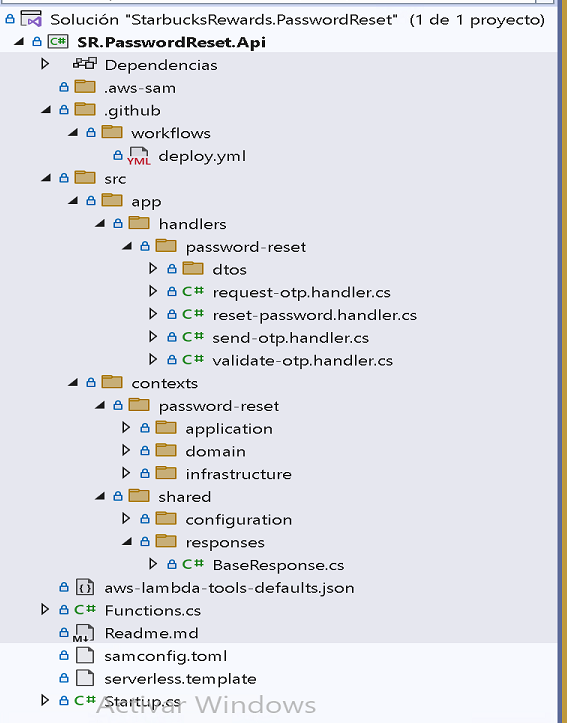

Para la solución se ha creado 4 APIs las cuales siguen el principio de Responsabilidad Única (Single Responsibility Principle) y representan cada paso específico del flujo de restablecimiento de contraseña. Veamos cada una:

1. `/password-reset/request` (RequestOtpHandler):

* Se encarga exclusivamente de validar que el correo electrónico existe en la base de datos.

2. `/password-reset/send-otp` (SendOtpHandler):

* * Validar si el correo existe en AWS Cognito (asegurando que es un usuario válido)
  * Generar y enviar el código OTP al correo del usuario a través de Amazon SES

3. `/password-reset/validate` (ValidateOtpHandler):

* Se especializa en validar que el código OTP ingresado sea correcto y corresponda al usuario.

4. `/password-reset/reset` (ResetPasswordHandler):

* Se dedica únicamente a realizar el cambio efectivo de la contraseña.

Beneficios de esta separación:

* Mejor manejo de errores: Cada API puede manejar sus propios casos de error específicos.
* Mayor seguridad: Permite implementar diferentes niveles de validación en cada paso.
* Mejor mantenibilidad: Los cambios en una funcionalidad no afectan a las otras.
* Escalabilidad: Cada endpoint puede escalarse de manera independiente según la demanda.

### **Arquitectura y Patrones de Diseño**:

Los servicios se han implementado siguiendo una arquitectura hexagonal y los principios de Domain-Driven Design (DDD), SOLID y Buenas prácticas  lo que facilita una clara separación entre la lógica del negocio y las interacciones externas.

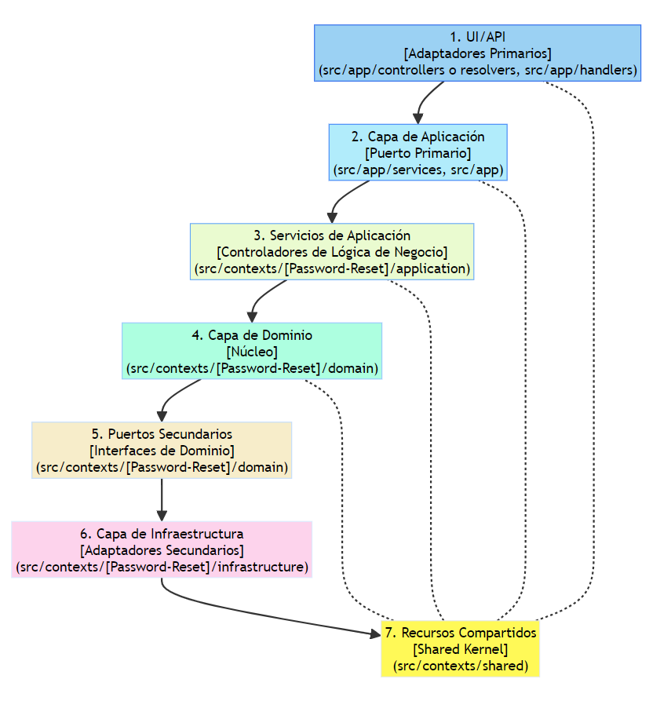

#### **UI/API [Adaptadores Primarios]** - [1]

**Función**: Interfaz de usuario y puntos de entrada de la API.

#### **Capa de Aplicación [Puerto Primario]** - [2]

**Función**: Orquestación de la lógica de aplicación.

#### **Casos de Uso [Controladores de Lógica de Negocio]** - [3]

**Función**: Manejo específico de casos de uso de la lógica de negocio.

#### **Capa de Dominio [Núcleo]** - [4]

**Función**: Núcleo de la lógica de negocio.

#### **Puertos Secundarios [Interfaces de Dominio]** - [5]

**Función**: Interfaces para la comunicación externa.

#### **Capa de Infraestructura [Adaptadores Secundarios]** - [6]

**Función**: Implementaciones técnicas y de soporte.

#### **Recursos Compartidos [Shared Kernel]** - [7]

**Función**: Código y funcionalidades comunes.

## Herramientas Requeridas para levantar el proyecto en la Local

- **AWS CLI:** Debes tener la AWS Command Line Interface instalada y configurada con tus credenciales.

* Herramientas de Desarrollo Base:
  * Visual Studio 2022
  * SDK de .NET 8
  * AWS Toolkit para Visual Studio
  * AWS CLI (Command Line Interface)
* Herramientas AWS específicas:
  * AWS SAM CLI (instalado mediante `winget install Amazon.SAM-CLI`)
  * AWS Credentials configuradas
  * AWS Lambda Templates para .NET

## Uso En Local

Antes de comenzar, asegúrate de tener configuradas tus credenciales de AWS. Esto es necesario para que Serverless Framework pueda interactuar con los servicios de AWS. Sigue estos pasos si aún no lo has hecho:

### Configuración de AWS

1. **Instalar AWS CLI**: Asegúrate de tener el AWS Command Line Interface instalado en tu máquina.
2. **Ejecutar AWS Configure**: En tu terminal, ejecuta `aws configure` y sigue las instrucciones para ingresar tu Access Key ID, Secret Access Key, región por defecto, y el formato de salida.

Una vez configurado AWS, puedes proceder con el uso del proyecto:

### Pasos para el uso del proyecto en local

Ejecutar los siguientes comandos para pruebas en local

```bash
dotnet restore - Obtener dependencias
dotnet build - Compilar el código .NET
sam build --template-file serverless.template - Preparar entorno serverless
sam local start-api - Iniciar API local
```

## Endpoints de la API

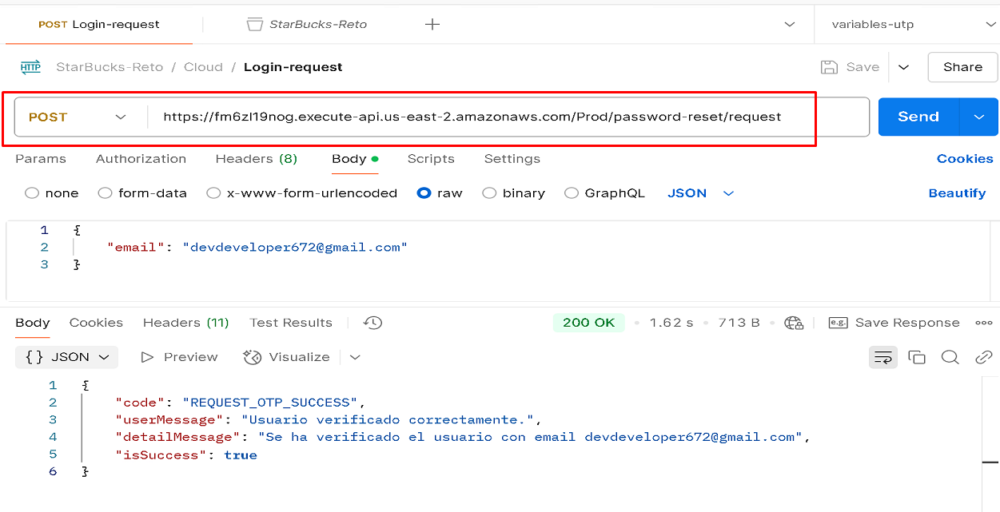

### /password-reset/request` (RequestOtpHandler):

#### Detalle

- **Descripción:** Este endpoint tiene solo la responsabilidad de validar si existe o no el correo en la base de datos.
  Este resultado deberá ser utilizado para consumir el recurso:
- **Datos de Entada:**
  - `email`: Es el correo del cliente/usuario que se validará si existe en la base de datos.
- **Códigos de respuesta:**
  - `Code`: Códigos de respuestas definidos para interpratar el resultado de la consulta.
    - REQUEST_OTP_SUCCESS: Indica que el email de usuario si existe en la base de datos.
    - USER_NOT_FOUND: Inidca que el email de usuario no existe en la base de datos.
  - userMessage: Es un mensaje simple, puntual para mostrar al usuairo en caso de error.
  - detailMessage: Es un mensaje mas detallado que solo servirá para revision interna en caso de errores.

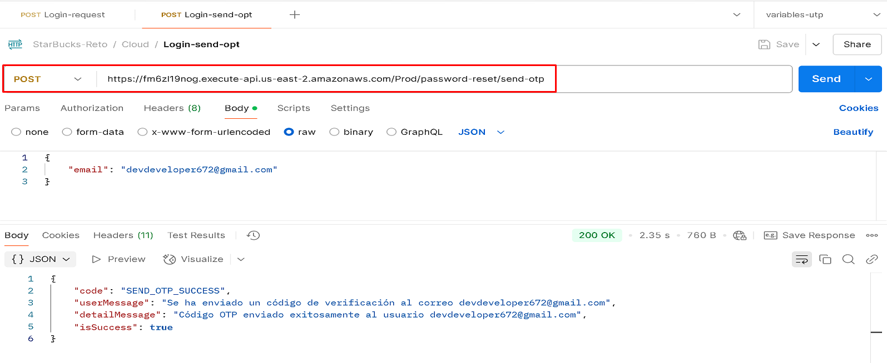

### /password-reset/send-otp` (SendOtpHandler):

#### Detalle

- **Descripción:** Tiene la responsabilidad de validar si el correo existe en AWS Cognito (asegurando que es un usuario válido) y de enviar el código OTP al correo del usuario a través de Amazon SES.
  Este resultado deberá ser utilizado para consumir el recurso:
- **Datos de Entada:**
  - `email`: Es el correo del cliente/usuario que se validará en cognito
- **Códigos de respuesta:**
  - `Code`: Códigos de respuestas definidos para interpratar el resultado de la consulta.
    - REQUEST_OTP_SUCCESS: Indica que el email de usuario si existe en la base de datos.
    - USER_NOT_FOUND: Inidca que el email de usuario no existe en la base de datos.
  - userMessage: Es un mensaje simple, puntual para mostrar al usuairo en caso de error.
  - detailMessage: Es un mensaje mas detallado que solo servirá para revision interna en caso de errores.

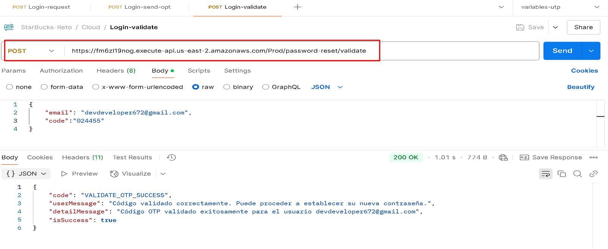

### /password-reset/validate` (ValidateOtpHandler):

#### Detalle

- **Descripción:** Se especializa en validar que el código OTP ingresado sea correcto y corresponda al usuario.
- Este resultado deberá ser utilizado para consumir el recurso:
- **Datos de Entada:**
  - `email`: Es el correo del cliente/usuario
  - `code`: Código OTP de 6 dígitos, solo números
- **Códigos de respuesta:**
  - `Code`: Códigos de respuestas definidos para interpratar el resultado de la consulta.
    - REQUEST_OTP_SUCCESS: Indica que el email de usuario si existe en la base de datos.
    - USER_NOT_FOUND: Inidca que el email de usuario no existe en la base de datos.
  - userMessage: Es un mensaje simple, puntual para mostrar al usuairo en caso de error.
  - detailMessage: Es un mensaje mas detallado que solo servirá para revision interna en caso de errores.

****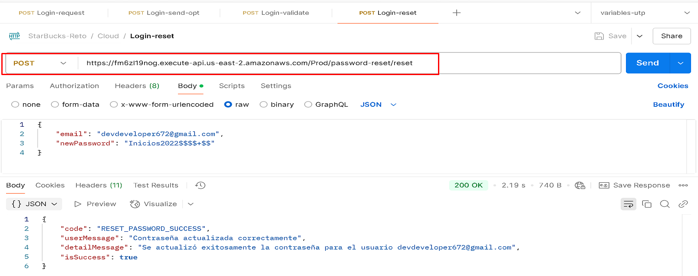

### /password-reset/reset` (ResetPasswordHandler):

#### Detalle

- **Descripción:** Se dedica únicamente a realizar el cambio efectivo de la contraseña..
- - Este resultado deberá ser utilizado para consumir el recurso:
- **Datos de Entada:**
  - `email`: Es el correo del cliente/usuario 
  - `newPassword`: Nueva contraseña 
- **Códigos de respuesta:**
  - `Code`: Códigos de respuestas definidos para interpratar el resultado de la consulta.
    - REQUEST_OTP_SUCCESS: Indica que el email de usuario si existe en la base de datos.
    - USER_NOT_FOUND: Inidca que el email de usuario no existe en la base de datos.
  - userMessage: Es un mensaje simple, puntual para mostrar al usuairo en caso de error.
  - detailMessage: Es un mensaje mas detallado que solo servirá para revision interna en caso de errores.

### Integración con GitHub - CI/CD

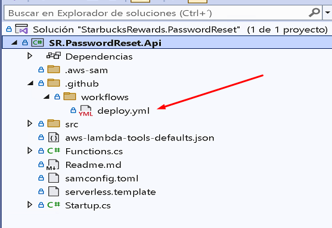

Este proyecto cuenta con integracion CI/CD con GitHub, lo que permite una entrega continua

Este flujo de trabajo de GitHub Actions se activa cuando hay push o pull requests a la rama main y realiza lo siguiente:

1. Configuración inicial:

* Usa Ubuntu como entorno de ejecución
* Define variables para la región AWS (us-east-2) y versión de .NET (8.0.x)

2. Pasos principales:

* Configura .NET 8 en el ambiente
* Instala las herramientas de Amazon Lambda
* Configura las credenciales de AWS usando secretos
* Restaura las dependencias del proyecto
* Compila el proyecto con AOT (Ahead of Time) para linux-x64 como self-contained
* Despliega a AWS Lambda usando un template serverless

3. Características importantes:

* Usa compilación AOT para mejor rendimiento en Lambda
* Genera un binario self-contained que incluye el runtime
* Utiliza un bucket S3 para almacenar los artefactos
* Despliega usando CloudFormation con el stack name "starbucks-password-reset"

4. Seguridad:

* Maneja credenciales AWS como secretos
* Usa la última versión de las actions (v4)

Este workflow automatiza completamente el proceso de build y despliegue, optimizando el rendimiento con AOT y asegurando que la función Lambda tenga todo lo necesario para ejecutarse.

---

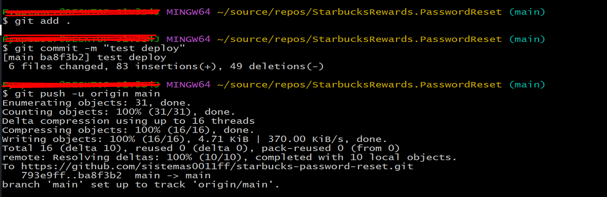
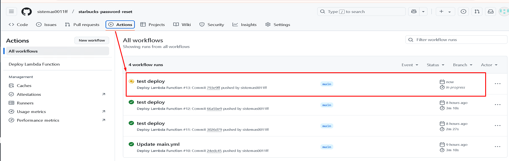

```
```

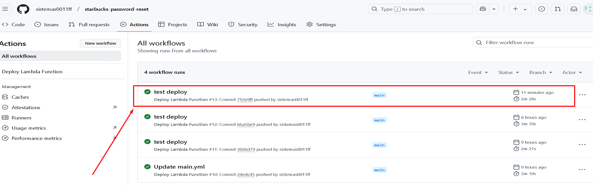

JSON en la carpeta Recursos del proyecto:
- 📥 [Descargar Colección Postman - Starbucks Reto](recursos/StaBucks-Reto.postman_collection.json)


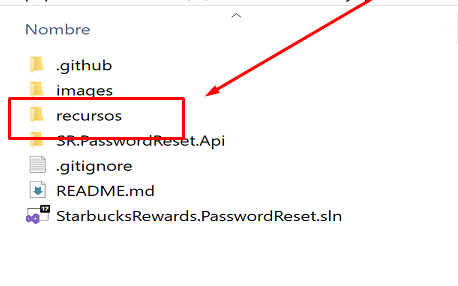
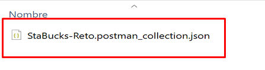

Correo para la prueba:

devdeveloper672@gmail.com
CLAVE: Edimax0011ff

Accesso a AWS: 


### Autor

- **Arturo Eduardo Fajardo Gutiérrez**
